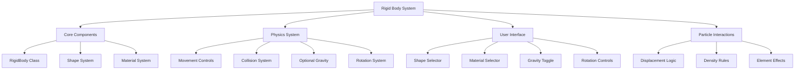
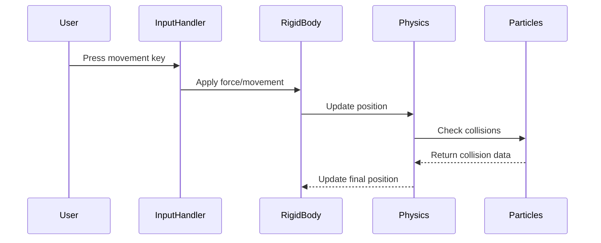
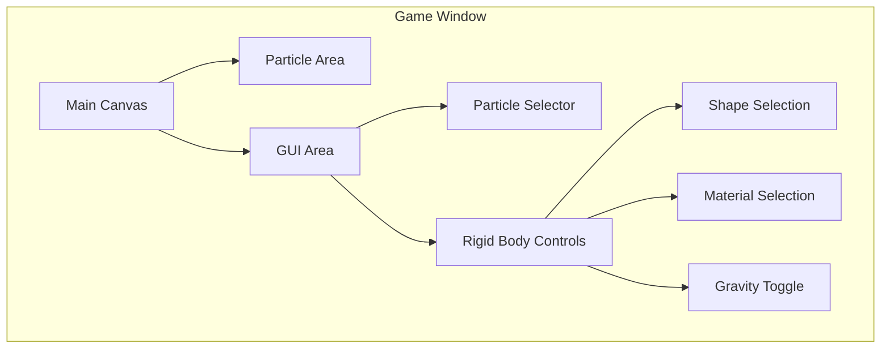

# Rigid Bodies Implementation Plan

## Overview

This document outlines the plan for adding rigid body functionality to the powder simulator game. Rigid bodies will provide new gameplay elements like boxes and balls that maintain their shape and can interact with existing particle systems.

## System Architecture



## Data Structures

### RigidBody Class
```python
class RigidBody:
    def __init__(self, shape_type, material, x, y):
        self.shape_type = shape_type
        self.material = material
        self.x = x  # Center position
        self.y = y
        self.rotation = 0  # In degrees
        self.velocity = [0, 0]
        self.angular_velocity = 0
        self.gravity_enabled = False
        self.force = [0, 0]  # Current force being applied
        self.mass = self._calculate_mass()
        self.cells = self._generate_cells()
```

### Shape System
```python
shapes = {
    "box": {
        "cells": [(x, y) for x in range(-1, 2) for y in range(-1, 2)],
        "label": "BOX",
        "description": "3x3 solid box"
    },
    "ball": {
        "cells": [(0,0), (0,1), (1,0), (0,-1), (-1,0), (1,1), (-1,-1), (1,-1), (-1,1)],
        "label": "BALL",
        "description": "Circular shape"
    },
    "beam": {
        "cells": [(x, 0) for x in range(-2, 3)] + [(x, 1) for x in range(-2, 3)],
        "label": "BEAM",
        "description": "5x2 horizontal beam"
    },
    "triangle": {
        "cells": [(0,0), (-1,1), (0,1), (1,1), (-2,2), (-1,2), (0,2), (1,2), (2,2)],
        "label": "TRI",
        "description": "Triangle shape"
    }
}
```

### Material System
```python
rigid_materials = {
    "wood_block": {
        "name": "Wooden Block",
        "label": "WOOD",
        "density": 400,
        "friction": 0.5,
        "color": (139, 69, 19),
        "pushes_particles": True
    },
    "metal_block": {
        "name": "Metal Block",
        "label": "METL",
        "density": 1000,
        "friction": 0.2,
        "color": (192, 192, 192),
        "pushes_particles": True
    },
    "rubber": {
        "name": "Rubber",
        "label": "RUBR",
        "density": 200,
        "friction": 0.7,
        "color": (60, 60, 60),
        "pushes_particles": False
    },
    "crystal": {
        "name": "Crystal",
        "label": "CRYS",
        "density": 800,
        "friction": 0.1,
        "color": (200, 200, 255),
        "pushes_particles": True
    }
}
```

## Physics System

### Movement and Forces



### Explosion Interaction System
```python
class ExplosionManager:
    def __init__(self):
        self.explosion_force_factor = 0.3  # Reduced force for rigid bodies
        
    def apply_explosion_force(self, source_x, source_y, radius, rigid_body):
        # Calculate distance and direction
        dx = rigid_body.x - source_x
        dy = rigid_body.y - source_y
        distance = math.sqrt(dx*dx + dy*dy)
        
        if distance <= radius:
            # Calculate force magnitude (decreases with distance)
            force_magnitude = (1 - distance/radius) * self.explosion_force_factor
            
            # Calculate force direction
            angle = math.atan2(dy, dx)
            force_x = math.cos(angle) * force_magnitude
            force_y = math.sin(angle) * force_magnitude
            
            # Apply force to rigid body
            rigid_body.apply_force(force_x, force_y)
```

## User Interface

### Control Scheme
```python
CONTROLS = {
    "move_left": pygame.K_LEFT,
    "move_right": pygame.K_RIGHT,
    "move_up": pygame.K_UP,
    "move_down": pygame.K_DOWN,
    "rotate_ccw": pygame.K_r,
    "rotate_cw": pygame.K_f,
    "toggle_gravity": pygame.K_g,
    "delete": pygame.K_DELETE
}
```

### GUI Layout



## State Management

### Save/Load System
```python
def save_game_state():
    state = {
        "particles": serialize_particle_grid(grid),
        "rigid_bodies": [rb.to_dict() for rb in rigid_bodies],
        "achievements": achievements
    }
    with open("game_state.json", "w") as f:
        json.dump(state, f)

def load_game_state():
    try:
        with open("game_state.json", "r") as f:
            state = json.load(f)
        restore_particle_grid(state["particles"])
        rigid_bodies.clear()
        for rb_data in state["rigid_bodies"]:
            rigid_bodies.append(RigidBody.from_dict(rb_data))
        restore_achievements(state["achievements"])
    except FileNotFoundError:
        pass
```

## Implementation Timeline

### Week 1: Foundation
- [ ] Create RigidBody class
- [ ] Implement basic shapes
- [ ] Add material definitions
- [ ] Create spawn mechanism

### Week 1-2: Physics
- [ ] Implement movement system
- [ ] Add collision detection
- [ ] Create rotation mechanics
- [ ] Integrate force handling

### Week 2: Integration
- [ ] Add particle interactions
- [ ] Implement density-based mechanics
- [ ] Add explosion force effects
- [ ] Create state persistence

### Week 2-3: User Interface
- [ ] Add shape/material selectors
- [ ] Implement control scheme
- [ ] Create gravity toggle
- [ ] Add visual indicators

### Week 3: Polish
- [ ] Optimize performance
- [ ] Fix bugs
- [ ] Add visual effects
- [ ] Test edge cases

## Testing Strategy

### Unit Tests
- Test RigidBody physics calculations
- Verify collision detection
- Check state serialization
- Validate force application

### Integration Tests
- Test particle interactions
- Verify explosion effects
- Check save/load functionality
- Validate UI controls

### Performance Tests
- Measure FPS with multiple rigid bodies
- Test memory usage
- Check collision performance
- Validate particle interaction speed